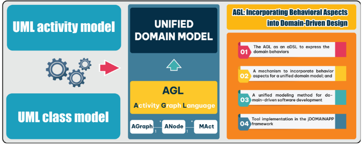
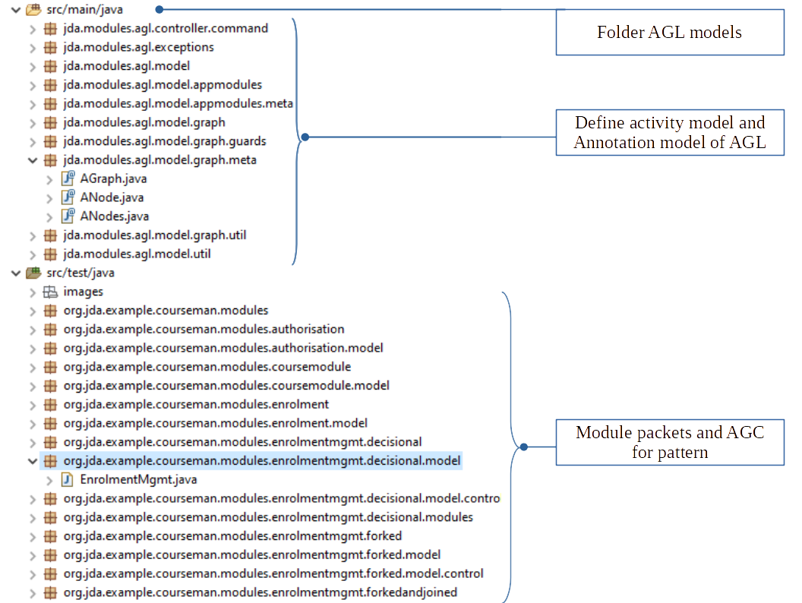

# MBSL (a.k.a AGL)
A repository for tool AGL: Incorporating Behavioral Aspects into Domain-Driven Design.
### This is a single, concise, pictorial and visual summary of the main findings of the article


***Version: current***
- This is the current release version


# Project structure
### Tool implementation in the jDomainApp framework.
   
```
jda:root	-> the root project
  common  -> module-common: (base) module used by other modules
  jda:main -> contains the core components of JDA
  modules:mbsl    -> implements MBSL language
   - ...
```

# Using the deployed module MBSL
GitHub repository: https://github.com/jdomainapp/jda-mbsl
1. Download the deployed module MBSL: jda-mbsl into the Jdomainapp folder
2. Unzip it into the Jdomainapp folder
The content of Jdomainapp folder needs to look like this:
```
  - common
  - main
  - modules
      - MBSL
   - ...
```
# How to run the tool in a Java software framework
The tool can be executed within an Integrated evelopment Environment (IDE), such as Eclipse; PostgreSQL Database
1. Use the "Import existing Maven project" to import the artifact project
2. PostgreSQL:
   - Create User: admin; Pass: password
   - Create a database name: domainds
## running a pattern form: Decisional, forked, joined, merged, sequential (in jda\modules\mbsl\src\test\java\org\jda\example\courseman\software):

# Code:
## Unified model:

``private void genGraph()`` 
### in class: ActivityModel transform CMT

### Result: Concrete Syntax Model (CSM) in the class: EnrolmentMgmt


